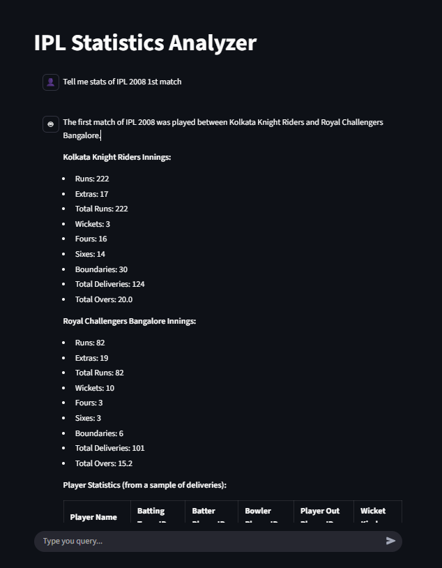
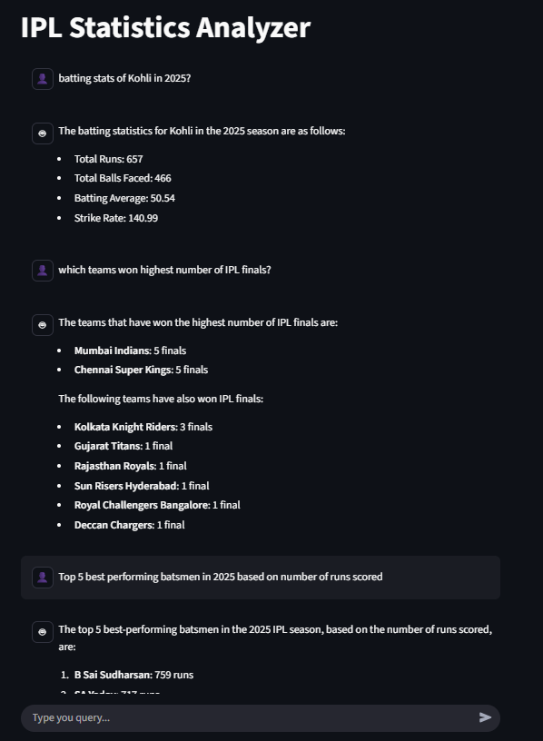
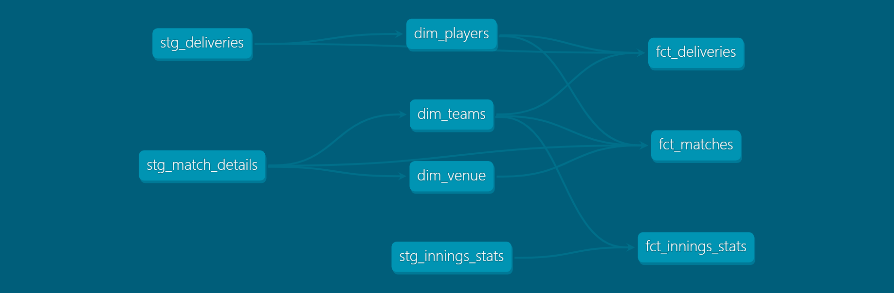

# 🏏IPL Stats Analyzer Chatbot - Your Cricket Data Agent🤖

This is an **end-to-end data application** that serves as a powerful analytics tool for Indian Premier League (IPL) data. It's designed to let users explore complex cricket statistics using **natural language**, thanks to a **LangChain-powered SQL Agent**. Think of it as a personal data analyst for IPL, all through a simple chat interface. 

|  |  |
| - | - |

## Features

* **Data Ingestion**: Collects and processes raw IPL match data from JSON files sourced from **cricsheet.org**.
* **Data Transformation**: Uses **dbt (Data Build Tool)** to model and transform the data into a clean, dimensional schema (`fact` and `dimension` tables) for efficient querying. Users can use any one of models like On-Device **Ollama**, **GROQ** and **Google Gemini**.
* **AI-Powered SQL Agent**: A **LangChain SQL Agent** translates natural language questions (e.g., "Who scored the most runs in the 2023 season?") into executable SQL queries. It also converts the DB output back into natural language for easy user understanding.
* **Local Data Warehouse**: Utilizes **DuckDB**, an in-process analytical data management system, for high-performance, on-the-fly queries without the need for a separate database server.
* **Intuitive UI**: A **Streamlit** chat interface provides a user-friendly way to interact with the data agent.


## Technologies Used

| Category | Tool/Technology | Description |
| :--- | :--- | :--- |
| **Data Source** | `cricsheet.org` | Source of raw IPL match data (JSON files). |
| **Database** | `DuckDB` | High-performance, embedded analytical database. |
| **ETL/ELT** | `Python`, `pandas`, `dbt` | Used for ingestion, transformation, and modeling. |
| **AI Framework** | `LangChain` | Powers the natural language to SQL conversion and response generation. |
| **User Interface** | `Streamlit` | Creates the interactive, chat-based web application. |


## Getting Started

### Prerequisites

To run this project locally, you'll need the following installed:

* **Python 3.8+**
* `pip`
* `git`
* **Google Gemini API Key** / **GROQ API Key** (Required for the LangChain SQL Agent)

### Local Setup

1.  **Clone the repository:**
    ```bash
    git clone https://github.com/chaitanya-vanapamala/ipl_analytics.git
    cd ipl_analytics
    ```

2.  **Set up Environment Variables:**
    Create a file named `.env` in the root directory and add your Google Gemini API key:
    ```
    GOOGLE_API_KEY="..."
    ```

3.  **Install dependencies:**
    ```bash
    pip install -r requirements.txt
    ```

4.  **Run the data pipeline (Optional):**

    `ipl_dwh/dev.duck` already equiped with the trasformed data from 2008 to 2015 IPL data. If you want to update the data then Execute the ingestion and transformation scripts. This step will:
    * Download raw JSON data and place them in `raw_data/ipl_male_json` directory.
    * Convert JSON to CSV and load into the DuckDB file using following script.
    ```bash
    cd ipl_data_loader
    python ipl_extract_load.py
    ```
    * Run all **dbt** models to create the final `fact` and `dimension` tables.
    ```bash
    cd ipl_data_pipeline
    dbt deps # to install dbt-utils package
    dbt build # starts Data Modeling
    ```

5.  **Launch the Streamlit App:**
    ```bash
    streamlit run app.py
    ```

    The application will open in your default web browser, allowing you to start chatting with the IPL Data Agent!


## Project Structure

- `ipl_agent` - LangChain Based SQL Agent
- `ipl_data_loader` - Data Loading from Json to DuckDB
- `ipl_data_pieline` - dbt (Data Build Tool) for dimentional modeling and transormation.
- `ipl_dwh` - Data Warehouse (Contains Duck DB file)
- `raw_data` - Ball by Ball raw data from https://cricsheet.org/
- `app.py` - Streamlit Application
- `requirements.txt` - Contains list of Python Dependencies


## Data Lineage

- `raw_ball_by_ball` - Raw data from json files.

The below diagram illustrates the flow of data from raw table to fact/dimensional tables, providing a clear overview of the pipeline's architecture.


